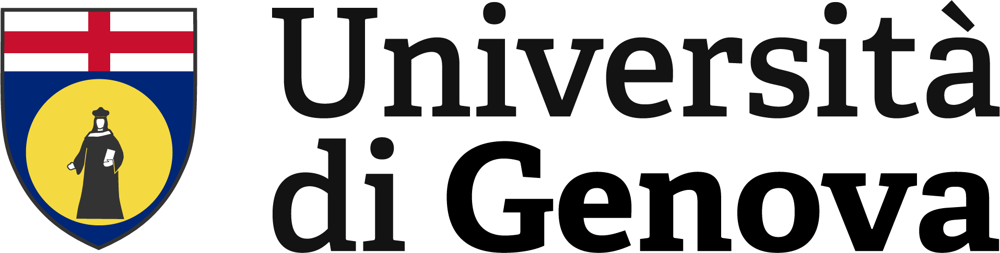
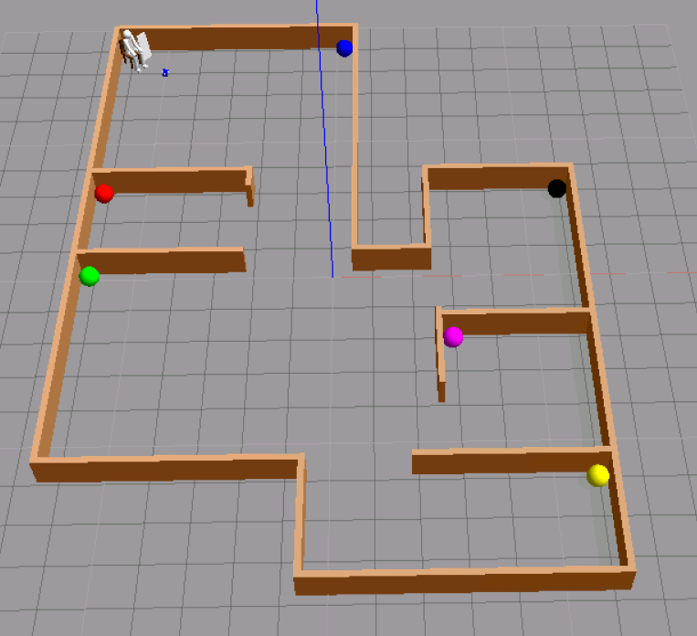
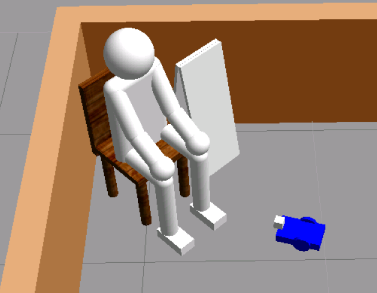
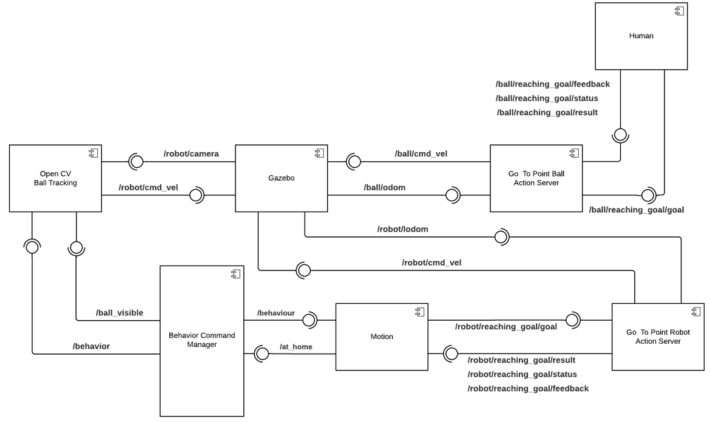
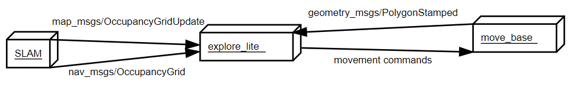
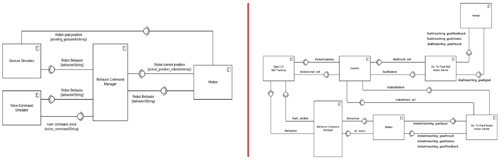
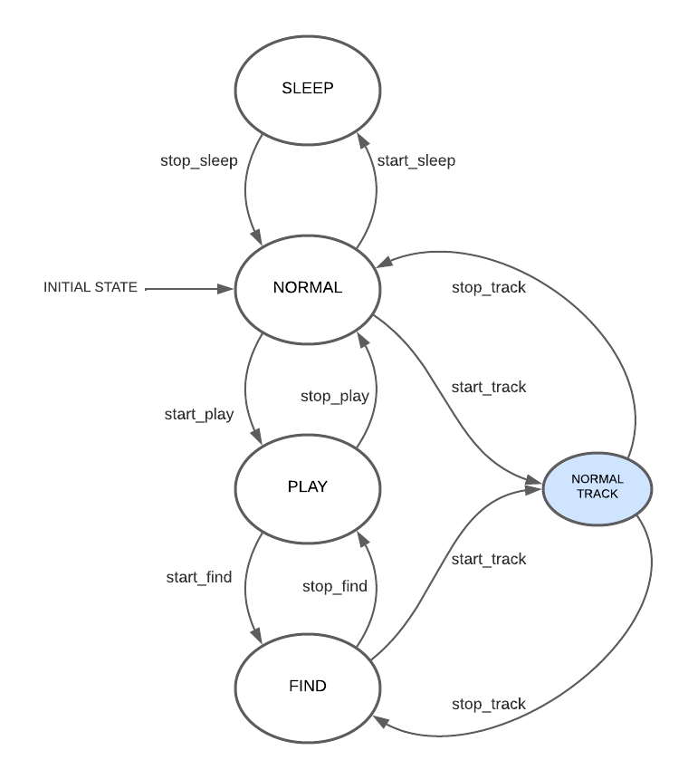

<!--
*** Thanks for checking out the Best-README-Template. If you have a suggestion
*** that would make this better, please fork the repo and create a pull request
*** or simply open an issue with the tag "enhancement".
*** Thanks again! Now go create something AMAZING! :D
-->

<!-- PROJECT LOGO -->
<br />
<p align="center">
  <a href="https://github.com/SerenaRoncagliolo/Exp_Robotics_Lab1">
    
  </a>

  <h3 align="center">Assignment 3 - Pet Behavioural Architecture</h3>
</p> 


<!-- TABLE OF CONTENTS -->
<details open="open">
  <summary><h2 style="display: inline-block">Table of Contents</h2></summary>
  <ol>
    <li>
      <a href="#about-the-project">About The Project</a>
      <ul>
        <li><a href="#built-with">Built With</a></li>
      </ul>
    </li>
    <li>
      <a href="#software-architecture">Software Architecture</a>
      <ul>
        <li><a href="#components-architecture">Components Architecture</a></li>
        <li><a href="#action-servers">Action Servers</a></li>
        <li><a href="#state-machine">State Machine</a></li>
        <li><a href="#ros-topics">ROS Topics</a></li>
        <li><a href="#ros-messages">ROS Messages</a></li>
        <li><a href="#rqt">Rqt_graphs</a></li>
      </ul>
    </li>
    <li><a href="#repository-organization">Repository Organization</a></li>
    <li><a href="#prerequisites">Prerequisites</a></li>
    <ul>
        <li><a href="#ros">ROS</a></li>
        <li><a href="#python">Python</a></li>
     </ul>
    <li><a href="#installation">Installation</a></li>
    <li><a href="#working-hypo">Working hypothesis and environment</a></li>
    <ul>
        <li><a href="#system-features">System's features</a></li>
        <li><a href="#system-limitations">System's limitations</a></li>
        <li><a href="#future-work">Future work</a></li>
    </ul>
  </ol>
</details>


<!-- ABOUT THE PROJECT -->
## About The Project

This system is built to simulate an apartment made up of six-room where a human and a per robot can interact. The project made use of a Gazebo simulation which is also visualized in RViz. The robot can follow four different behaviours: _Normal_, _Sleep_, _Play_ and _Find_. The robot is a wheeled dog equipped with a camera and a laser sensor. Its main objective is to build a map of the whole environment. The human simulated can interact with the robot and command it to start playing, giving it a command of which room to reach as well. 
The Sleep and Normal behaviour are the same implemented in the previous version of this project, which can be found at this [link](https://github.com/SerenaRoncagliolo/Exp_Robotics_Lab_2). However, in the current version of the project, they are developed considering the obstacle within the apartment, so that the robot can autonomously avoid them without colliding with them. 
When the robot assumes Play behaviour, it moves to the human location and waits for a command which indicates which room it should move to.
While in Find behaviour instead, the robot starts exploring the environment and start mapping. Each room can be easily recogni.sed, because each of them contains a different coloured ball, which is detected by the robot camera and used to build a precise map.
In this version, we have also added two sub_state _Normal Track_ and _Find Track_. When the robot sees a coloured ball while in Normal or Find behaviour, he enters these sub-states to get closer to the ball and saves its position within the map it is building.
The objective of this project was to modify the provided robot model by using additional links and joints, build a suitable ROS architecture to implement the robot’s behaviors and simulate the system behavior on Gazebo.


### Built With
The project was build with:

* [ROS Kinetic](http://wiki.ros.org/kinetic/Installation/Ubuntu)
* [Python3](https://www.python.org/downloads/)
* [SMACH](http://wiki.ros.org/smach)


## Software Architecture

### Simulation 
Our project is simulated in a 3D [**Gazebo**](http://gazebosim.org/) environment. Gazebo is a 3D dynamic simulator that efficiently simulate robots in complex indoor and outdoor environments. It provides physics simulation having a rich library of robot models and environments, a wide variety of sensors, and a user-friendly graphical interface.

<p align="center">
<a>
    
</a>
</p>

### Robot model 
We developed a rough and simple 3D model to simulate a pet robot within Gazebo. The robot is made up of two classic wheels and a spherical one that allow it to move. The robot model used is the same of the previous assignment but without the neck joint in order to keep the head fixed and thus the camera as well. A camera has been applied to the robot's head to make it capable of detecting the ball. The robot is also equipped with a hokuyo laser scan, whose modelization can be found at thil [link](http://gazebosim.org/tutorials/?tut=add_laser).
If we want to simulate a robot on Gazebo or any other simulation software, we need to add physical and collision properties, such as the dimension of the geometry to calculate the possible collisions, the weight that will give us the inertia, and so on. To do so we use two files: a URDF and a XACRO (“XML Macros) file.
URDF is an XML file format used in ROS to describe all elements of a robot. In this file additional simulation-specific tags can be added to work properly with Gazebo as explained in this [link](http://gazebosim.org/tutorials?tut=ros_urdf&cat=connect_ros). URDF files can only specify the kinematic and dynamic properties of a single robot in isolation and not the pose of the robot itself within a world. The XACRO file instead helps in reducing the overall size of URDF files and makes it easier to read and maintain the packages. We can use it to create modules that can be reused in the URDF, in case of repeated structures, such as the wheels of a robot. 

<p align="center">
<a>
    
</a>
</p>


### Components Architecture

<p align="center"; style='text-align: center'>
<a>
    <figure> 
      
    </figure>
</a>
</p>
 
 The architecture is made up of three ROS packages and four custom nodes. The external packages are used to move the robot within the apartment (_move_base package_), to create a map using the scan laser (_gmapping_) and explore the unkown part of the environment (_explore_lite_).

**ROS Packages**
* **move_base package**: 
  * The move_base ROS node belongs to the [navigations stack ](http://wiki.ros.org/navigation) . It allows ROS to interface with the navigation stack of a robot
  * This package provides an implementation of an _action_ that, given a goal in the world, will attempt to reach it with a mobile base. It links together a _global_ and _local_ planner accomplish global navigation. For more documentation on the client-to-server architecture and the _actionlib_ package- follow this [link](http://wiki.ros.org/actionlib)
  * The navigation stack uses two constmaps to store information about the obstacle in the environment: _global planning_ and _local planning_.
  * _global planning_ is used to create long-term plans over the entire environment, it configuration parameters are saved in _global_costmap_params.yaml_. They define what coordinate frame the costmap should run in, such as for example the robot frame. Here we can set the _update_frequency_ and _publish_frequency_ to make the planner more reactive to changes and faster in correcting mapping errors. 
  *  _local planning_ is used mainly for _obstacle avoidance_. Its parameters are saved in _local_costmap_params.yaml_. Here we can set the _width_ and _height_ parameters to improve the local mapping and avoid strange trajectory
  *  Both costmaps present some common configuration parameters which are saved in _costmap_common_params.yaml_. Here we can set the _obstacle_range_ and the _robot_radius_ parameters to define the obstacle avoidance navigation
  *  The _base_local_planner_ is instead responsible for computing velocity commands to send to the mobile base of the robot. It configuration parameters are saved in base_local_planner_params.yaml_. Here the velocity can be set using _max_vel_x_, _min_vel_x_, _acc_lim_x_ and _acc_lim_theta_. 
  *  Parameters were set following documentation for the navigation stack available at this [link](http://wiki.ros.org/navigation/Tutorials/RobotSetup)
* **gmapping package**:
  *  This [package](http://wiki.ros.org/gmapping) provides a ROS wrapper for OpenSlam's Gmapping.  
  *  The gmapping package provides laser-based SLAM (Simultaneous Localization and Mapping), as a ROS node called slam_gmapping. It can create a 2D occupancy grid map from laser and pose data collected by a mobile robot. 
  *  To use it we need a mobile robot that provides odometry data and is equipped with a horizontally-mounted and  fixed laser range-finder
  *  This package transform each incoming scan into the _odom tf frame_
  *  It takes in a _sensor_msgs/LaserScan_ message  and builds a map than can be retrieve via a ROS topic or service.
  *  Further information on how to the map is built can be found at this [link](http://wiki.ros.org/pr2_simulator/Tutorials/BuildingAMapInSimulation)
* **explore_lite**: 
  * This package provides a greedy frontier-based algorithm for environment exploration. When this node is running, robot will greedily explore its environment until no frontiers could be found. 
  * Commands to move the robot are then sent to the _move_base_ node, which needs to be configured properly
  <p align="center">
<a>
    
</a>
</p>


**Components**  
* **Behavior Command Manager:** this component simulates the Finite State Machine (FSM) and controls the switching between the four robot behaviours (Normal, Sleep, Play and Find) described in detail in the section _State Machine_. Its connection to the other components is given in the description of their implementation.
* **Motion:** this component moves the robot when it assumes Normal, Sleep or Play behaviour. To get information regarding the current behaviour of the robot, it subscribes to the /behaviour topic and moves the robot accordingly.
  * in Normal behaviour: the robot get a random goal position within the map max dimensions and moves to it. The position is sent to the _move_base_ node, which moves the robot accordingly. 
  * in Sleep behaviour: in this state, the component moves the robot to a predefined _home position_, which is sent again as goal position to the server _move_base_. When the robot has reached home, the Motion component publishes a  message on the topic /at_home. This topic is subscribed by the Behaviour controller to have an update regarding the robot location.
  * in Play behaviour: if not there already, the robot should first move in from of the human, so that he can receive the next command. Once in front of him, the component publishes on the topic /at_home, which is subscribed by the component Human Simulator. The robot can then receive a command, which tells it which room it should move to. If the location is already known and contained in the known map of the apartment, then the robot can reach it. If not it should notify the Behaviour component by publishing on the topic /room_unkown. Once done so, the robot switches to Find behaviour.
* **OpenCv Ball Tracking:** as in the previous lab, we implemented a component that makes use of the OpenCV library to detect the ball. [_OpenCV_](https://opencv.org/) is a library used for real-time computer vision. ROS can be interfaced to OpenCV by using [CvBridge](http://wiki.ros.org/cv_bridge) and [convert ROS images](cv_bridge/Tutorials/ConvertingBetweenROSImagesAndOpenCVImagesPython - ROS Wiki) into OpenCV images, or vice versa. This library is used to determine if the ball is contained within the robot camera range. This component subscribes to the robot camera topic given by _/robot/camera1/image_raw/compressed_. If the ball is detected while the robot is in Normal or Find state, it will switch respectively to the sub-state Normal Track or Find Track. Once in these substates, the OpenCV Tracking component publishes a velocity on the /cmd_vel topic. This is done because we want the robot to get as close as possible to the detected ball. Once it gets close, it alerts the Behaviour manager component by publishing on the topic /at_ball. If the robot was in the Normal Track substate it goes back to the Normal state. If instead, it was in the Find Track substate, it should check if the room in which it is currently located corresponds to the one given in the last user command. If so, it means that it has finally reached the desired goal room, it publishes a boolean message on the /at_room topic and it turns back to Play Behaviour. Otherwise it goes back to Find state. As opposed to the implementation in the previous version of the project, the robot should now be capable to distinguish the colour of the ball, which will be used to identify the room.
* **Human Interface Simulator:** this component is used to simulate a human interacting with the robot. It can publish a message on the topic /start_play, which is subscribed by the Behaviour manager. This command is given at random time instantm and it gives the name of the room where the robot is supposed to move.

### Differences with previous lab
<p align="center">
<a>
    
</a>
</p>


### State Machine

<p align="center">
<a>
    
</a>
</p>

The wheeled dog has four behaviors:

* NORMAL BEHAVIOUR:
  * The robot moves randomly in different locations of the apartment. 
  * It can go from Normal behaviour to Play behaviour when he receives a command from the user. Otherwise, when it is moving, the sleep timer is activated and the robot should assume SLEEP behaviour;
  * While moving in Normal state, the robot can detect the coloured object contained inside the rooms and enter the Normal Track sub-state, in which it moves closer to the object and save its position, in case it wasn't already been detected previously.
* SLEEP BEHAVIOUR: 
  *  the robot moves to a predefined position which indicates "home position" and stops there for a given time interval. 
  *  After a certain time interval, it "wakes up" and return to Normal behaviour; 
* PLAY BEHAVIOUR: 
  * The robot enters this behaviour when it is given the command from the user;
  * once in this state, it moves to the location where the person is;
  * it waits there to receive the command which tells it which room to go to;
  * if the location is already known, meaning the coloured ball inside that room was already been detected, it moves to the room;
  * if the location is unknown it switches to Find behaviour;
  * when the robot has reached this goal position, it stays there for some time and then moves back to the person where it waits for the next command;
* FIND BEHAVIOUR:
  * in this state, the robot explores the environment trying to detect the coloured object inside the rooms;
  * it can use already known positions or explore independently. 
  * when an object is detected, as done in Normal state, it enters the Find Track sub-state to move closer to the object and save the position.

### ROS Topics
As shown in the UML graph or the system architecture, the system make use of the following topics:
* /behavior: this topic is subscribed by the OpenCV Tracking and Motion components to read the current behavior of the robot. It is used by the Behavior Manager component to publish the state of the robot as a String
* /at_home: this topic is subscribed by the behavior manager to check if the robot has reached or not home position, so that it can switch to sleep behavior. It is used by motion to publish this condition as a boolean
* /ball_visible: topic subscribed by Behavior manager to check if the ball is inside the visual range of the robot or not. It is pusblish by the OpenCV tracking component using a boolean
* /robot/camera: topic subscribed by the OpenCV tracking component to get the ROS image and convert it in OpenCv image. 
* /robot/cmd_vel: topic published by the OpenCV tracking component to set the robot velocity in Gazebo. This topic is also published by the Go To Point Robot Action server 
* /robot/odom: topic used to get by the robot odometry from Gazebo simulator. It is subscribed by the Go to Point Robot Action server
* /robot/reaching_goal: set of topics used by the action server Go to Point Robot and defined by:
  * /result
  * /status
  * /feedback
  * /goal  
* /ball/cmd_vel: topic published by the OpenCV tracking component to set the robot velocity in Gazebo. This topic is also published by the Go To Point Robot Action server 
* /ball/odom: topic used to get by the robot odometry from Gazebo simulator. It is subscribed by the Go to Point Robot Action server
* /ball/reaching_goal: set of topics used by the action server Go to Point Robot and defined by:
  * /result
  * /status
  * /feedback
  * /goal  

### Rqt_graphs 

<p align="center">
<a>
    
</a>
</p>

## Repository Organization
The repository contains the following folders:

* **Config**: configuriation file to initialize RViz correctly
* **Documentation**: it contains the html and latex documentation produced with Doxygen
* **images**: contains .png images used in the README:md file
* **launch**: contains two launch files:
  *  gazebo_world.launch: it launch the gazebo world contained the simulation model of the robot, human and ball
  *  pet_behavior.launch: it starts the behaviour architecure of the project
*  **param**: it contains the configuration parameters for the _move_base_ package
*  * **src**: contains the relative script of the main components of the architecture:
  *  behavior_manager.py
  *  human_simulator.py
  *  motion.py
  *  opencv_tracking.py
* **urdf**: it contains the files to simulate a robot and a human in Gazebo;
* **worlds**: it contains the world used for implementing the simulation;
 
## Prerequisites

### Ros
This project is developed using [ROS Kinetic](http://wiki.ros.org/kinetic/Installation/Ubuntu). Follow [instructions](http://wiki.ros.org/kinetic/Installation/Ubuntu) for installation.

### Python
This project is developed using [Python](https://www.python.org/downloads/). Follow [instructions](https://www.python.org/downloads/) for installation.

### Smach
This project make use of the smach library to use the FSM.
 ```sh
 $ sudo apt-get install ros-kinetic-smach-viewer
 ```
 ### OpenCV library
 Install **OpenCV** library using:
  ```sh
  $ sudo apt-get install python-opencv
 ```
### numpy library
Install **numpy** library using the following:
  ```sh
  $ pip install numpy
  ```
### Other packages
Install **OpenSLAM gmapping** package using the following:
  ```sh
  $ sudo apt-get install ros-<ros_distro>-openslam-gmapping
  ```  
Install the **navigation** package using the following:
  ```sh
  $ sudo apt-get install ros-<ros_distro>-navigation
  ``` 
Install the **explore_lite** package using the following:
  ```sh
  $ sudo apt-get install ros-<ros_distro>-explore-lite
  ``` 
  
## Installation
This instructions assumes that you have installed **catkin**, if not it is necessary to follow the instruction at [catkin installation](https://wiki.ros.org/catkin#Installing_catkin). After installation source the environment:
 ```sh
 $ source /opt/ros/kinetic/setup.bash
 ```
 1. Create a workspace in ROS following this [tutorial](http://wiki.ros.org/catkin/Tutorials/create_a_workspace)
 2. Enter the folder src and  clone the repository
   ```sh
   git clone https://github.com/SerenaRoncagliolo/Exp_Robotics_Lab_2.git
   ```
  2. Rename it the repository exp_assignment2
  3. Enter the repository at the top level and run
   ```sh
    $ catkin_make
    $ source devel/setup.bash
   ```
   4. Enter the following to start the program:
   ```sh
    $ roslaunch exp_assignment2 gazebo_world.launch
    $ roslaunch exp_assignment2 pet_beaviour.launch
   ``` 

## Working hypothesis and environment

### Systems features

### Systems limitations

### Future work

<!-- CONTACT -->
## Contact

Serena Roncagliolo - s4233330@studenti.unige.it

Project Link: [https://github.com/SerenaRoncagliolo/Exp_Robotics_Lab2](https://github.com/SerenaRoncagliolo/Exp_Robotics_Lab2)


